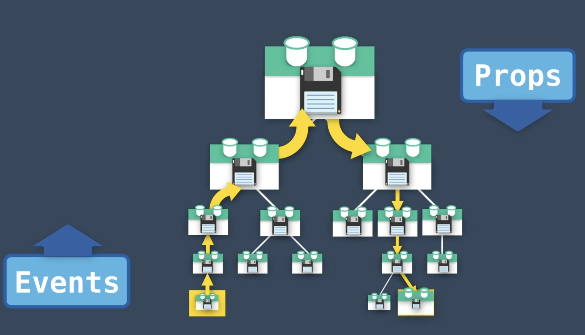
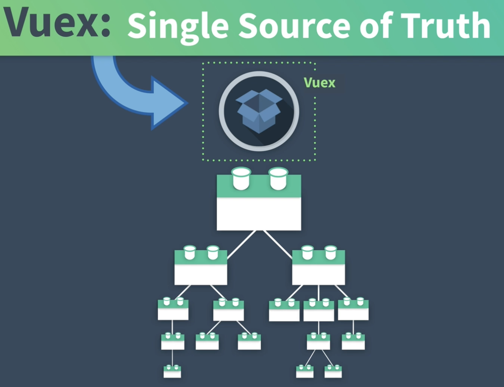
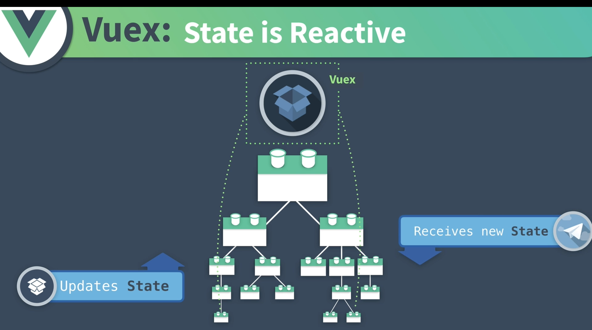
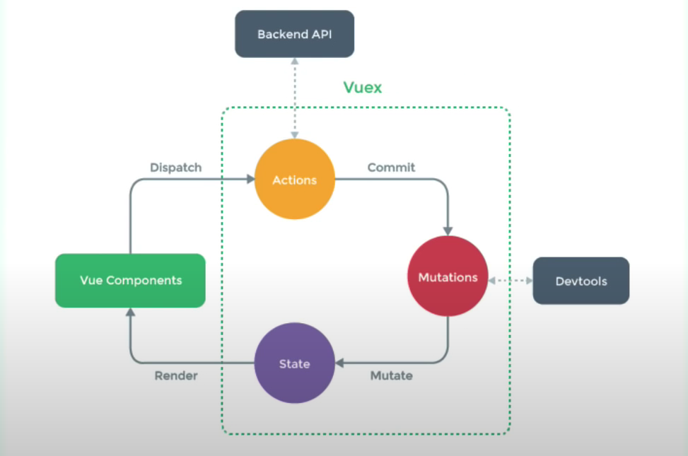
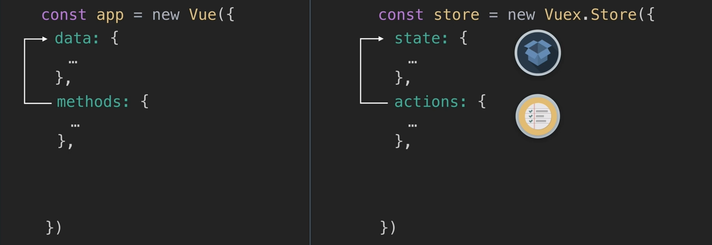
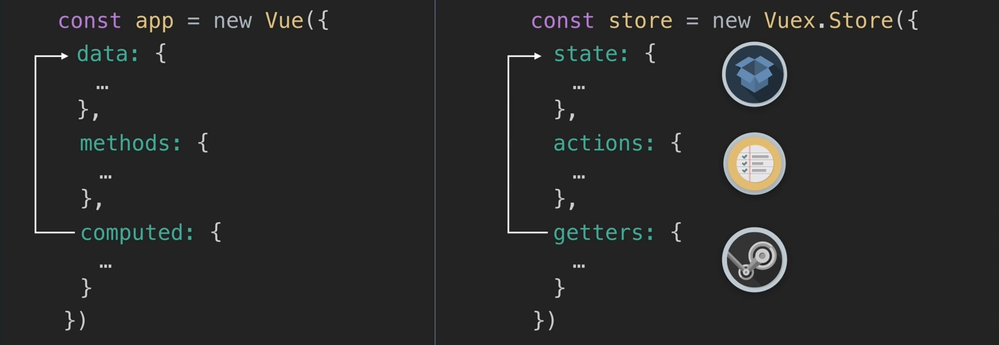
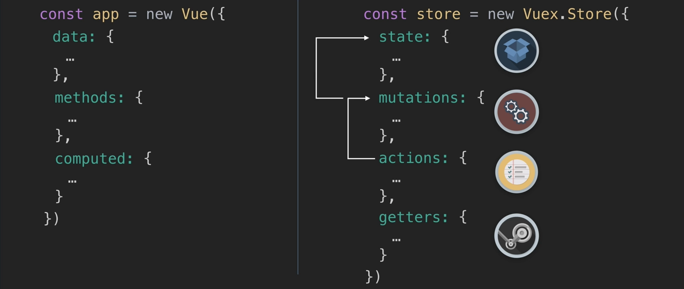
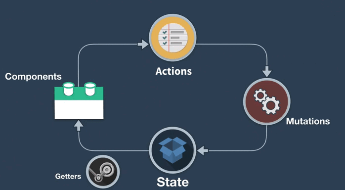
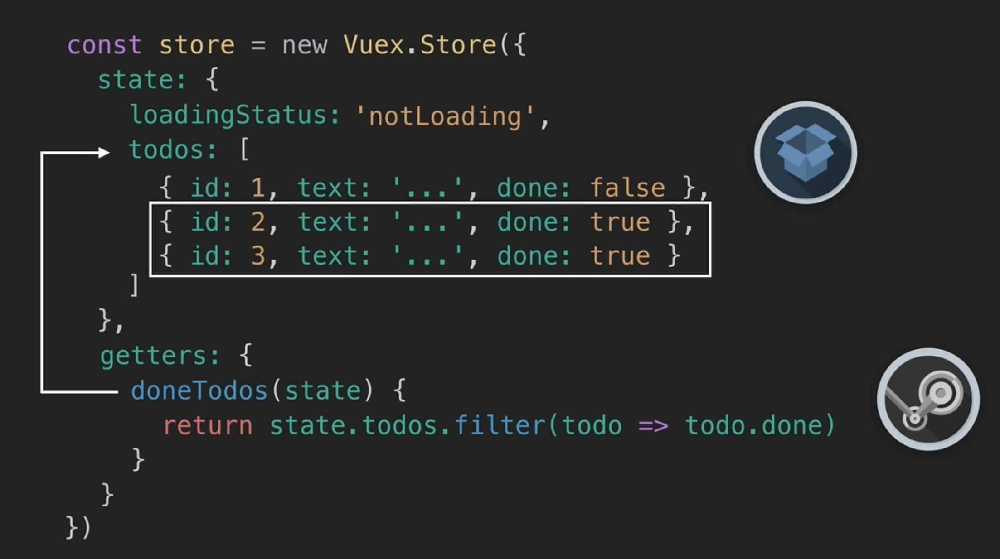
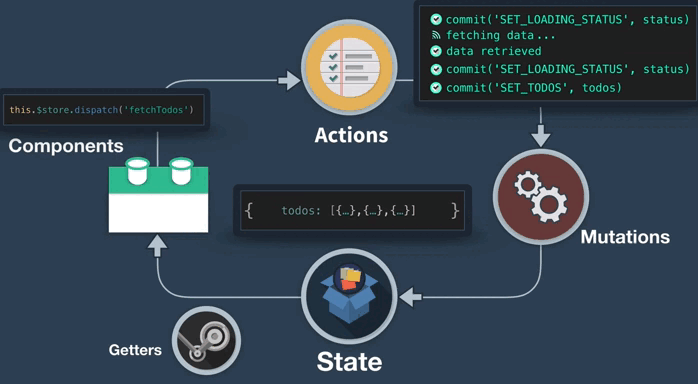

# Vuex


## ¿Qué es Vuex? 

Vuex es una librería de patrones y un gestor de estados de una aplicación. Se utiliza normalmente con la librería de Vue y es muy similar a redux o Flux, pero más sencillo.

Con vuex dispones de un `Store` centralizado para todos los componentes. Como un 'almacén' donde se guarda el estado de la aplicación. Esto se hace así porque en muchos casos los componentes de una aplicación han de compartir el estado, y además de esta forma tenemos una única fuente de datos para la totalidad de la aplicación. Con esto nos ahorramos el tener que estar pasando props de padres a hijos o emitiendo eventos de los hijos a los padres, a través de muchos componentes:

 

Además este estado global es reactivo.


Para entender Vuex, debemos familiarizarnos con ciertos conceptos:



- **State**: Estado o datos que hay disponibles para la aplicación, como por ejemplo la lists de ToDos, una serie de post, tokens, datos de usuario... etc.

- **Getters**: Valores computados del estado u obtenedores del estado.

- **Actions**: Funciones llamadas desde los componentes para realizar un commit (cometer) de una mutación del estado. Desde las acciones no se realiza la mutación del estado, sino que se realiza un commit de la mutación.

- **Mutations**: Mutaciones del estado, como una actualización de los datos etc.

- **Modules**: Cada módulo puede tener su propio estado, con sus getters, actiosn y mutatiosn, de esta forma pueden tenerse varios módulos como módulo de los post, un modulo de autentificación de usuario etc.


Todo esto hace surgir un problema, si diversos componentes pueden mutar el estado, hacer un seguimiento de éste puede ser problemático, haciendo del estado algo impredecible y complicado de tracear. Por ello Vuex nos da un patrón de gestión del estado completo, para realizar los cambios de una forma estandarizada y simple, y que se parece mucho a una instancia de vue normal.

Veamos un ejemplo simple.

### Es similar a una instancia de Vuex

De la misma forma que creamos una instancia de Vue, podemos crear un nuevo *Store* con `vuex.store`:

```js
// Vue
const app = new Vue({});
// Vuex
const store = new Vuex.Store({})
```

- Así como la instancia de Vue tiene un apartado `data()` que contiene los datos de esta instancia, nuestro nuevo Store tiene un apartado `state()` que contiene los diferentes estados (es como su data):

```js
// Vue
const app = new Vue({
  data: {
    // Datos
  }
})

// Vuex
const store = new Vuex({
  store: {
    // Estados
  }
})
```
**Ambos son reactivos**

- Mientras que vue tiene métodos, que son funciones que junto con otras cosas, pueden actualizar los datos que hay en `data`, en vuex tenemos las acciones (`actions`), que de la misma forma pueden cambiar el contenido del *Store*, el estado.



- De la misma forma que en Vue tenemos las *computed properties* que pueden acceder a lo que está almacenado en *data*, en Vuex tenemos los `getters` que acceden a lo que se almacena en el *state*.



- La **diferencia** entre la instancia de Vue y la de Vuex, es que en la instancia de Vuex, ademas de lo anterior, tenemos las mutaciones. Las `mutations`. Las mutaciones se utilizan para confirmar y realizar un seguimiento de los cambios de estado. La buena práctica es tener acciones, que llamen a mutaciones y estas mutaciones sean las que cambian el estado:




- Para usar esto desde un componente usaremos `this.$store.dispatch('fetchTodos')` que disparará la acción correspondiente para realizar todo lo anterior.



- Con los getters podemos por ejemplo filtrar las tareas realizadas, accedemos a lo que el *Store* contiene:


Además podemos usar las dev tools para ver cuando se han realizado los cambios e incluso revertirlos para deguggear


Para una explicación completa y más ejemplos, podemos ver el video introductorio de Vue Mastery en la página de Vuex, en esta dirección: [https://vuex.vuejs.org/#what-is-a-state-management-pattern](https://vuex.vuejs.org/#what-is-a-state-management-pattern).


