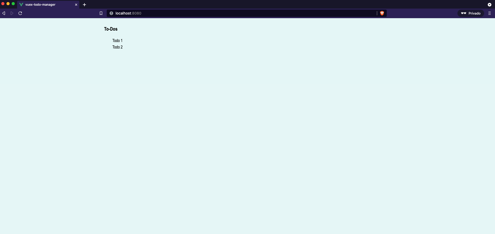
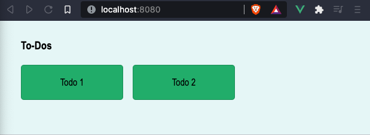

# Crear los componentes básicos


## Componente Todos.

Creamos un componente en la carpeta `components` que tendrá la lista de ToDos:
```html
<template>
  <div>
    <h3>To-Dos</h3>
  </div>
</template>

<script>
export default {
  name: 'Todos',

}
</script>

<style>

</style>
```

Agregamos este componente en App.vue:

```html
<template>
  <div id="app">
    <div class="container">
      <Todos />
    </div>
  </div>
</template>

<script>
import Todos from './components/Todos.vue'

export default {
  name: 'App',
  components: {
    Todos,
  }
}
</script>

<style>
body {
  font-family: "Franklin", "Arial narrow", Arial, sans-serif;
  line-height: 1.6;
  background: #e8f7f7;
}

.container {
  max-width: 1100px;
  margin: auto;
  overflow: auto;
  padding: 0 2rem;
}
</style>
```

## Crear la carpeta `store`.

Dentro de la carpeta raíz, creamos la carpeta que va a contener el *Store*. Dentro de ella creamos el archivo `index.js` que será el punto de entrada de vuex. Aquí es donde se combinan los módulos que tengamos. Debemos importar Vuex, y también debemos importar vue, así como los módulos que vallamos a usar, aunque aun no hemos creado ninguno, pero lo haremos después.

```js
//./store/index.js
import Vuex from 'vuex';
import Vue from 'vue';
import Todos from './modules/todos';

// Cargamos Vuex
Vue.use(Vuex);

// Creamos el Store
export default new Vuex.Store({
  modules: {
    Todos,
  }
})
```

- Así mismo en nuestro main.js debemos decir que nuestra instancia utiliza vuex. Siguiendo la forma de Vue3 queda:

```js
// ./main.js
import Vue from 'vue'
import App from './App.vue'
import store from './store'

Vue.config.productionTip = false

new Vue({
  store,
  render: h => h(App),
}).$mount('#app')

``` 

## Creando los módulos.

Dentro de la carpeta de *store*, creamos la carpeta *modules* y en ella el archivo `todos.js` que tendrá lo relativo al estado de `todos`.

```js
//./store/modules/todos.js
// En este archivo definimos State, getters y actions

const state = {
  todos: [
    {
      id: 1,
      title: 'Todo 1',
    },
    {
      id: 2,
      title: 'Todo 2',
    },
  ]
};

const getters = {};

const actions = {};

const mutations = {};

export default {
  state,
  getters,
  actions,
  mutations,
}
```
- Para poder acceder a las dos tareas que tiene de momento, ha de crearse un `getter`, que se podrá llamar desde cualquier componente para ver que hay en el estado en ese momento:

```js
const getters = {
  allTodos: (state) => state.todos
};
```
- Ahora en nuestro componente `Todos.vue` podemos utilizar el getter.
- Para obtener los datos que los getters proporcionan, la forma correcta de usarlos es en las `computed properties`.
Componente `Todos.vue`:

```html
<template>
  <div>
    <h3>To-Dos</h3>
    <div v-for="todo in allTodos" :key="todo.id" class="container">
      {{todo.title}}
    </div>
  </div>
</template>

<script>
import { mapGetters } from 'vuex';

export default {
  name: 'Todos',
  computed: mapGetters(['allTodos']),

}
</script>
<style>
</style>
```
Deberíamos obtener esto:



- Antes de continuar añadir algo de estilo a esta página, así que insertamos en nuestro componente de `Todos.vue`:

```html
<style scoped>
.todos {
  display: grid;
  grid-template-columns: repeat(3, 1fr);
  grid-gap: 1rem;
}
.todo {
  border: 1px solid #046c3d68;
  background: #24b675;
  padding: 1rem;
  border-radius: 5px;
  text-align: center;
  position: relative;
  cursor: pointer;
}
</style>>
```
De forma que nos queda así:

